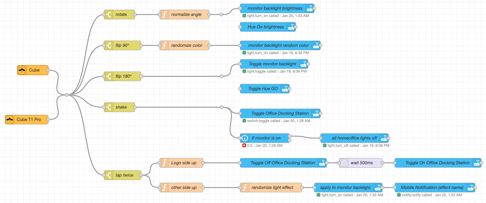

# Aqara Magic Cube T1 Pro External Converter 
[](https://ko-fi.com/jjpro)
[](https://patreon.com/jjpro)

## NOTE

A PR based on this converter is WIP, until it is finalized and officially merged, you may use the external converter file in this repo to make your cube fully function. 

Updates will be migrated into the PR only when this external converter proves to be solid by the community. 

Download the converter and report problems. 

Post your positive feedbacks or improvement ideas in Discussions. 

PRs: 
- Koenkk/zigbee2mqtt.io#1833
- Koenkk/zigbee-herdsman-converters#5367


## Supported Actions

- Operation Mode switch in Zigbee2MQTT
- Scene mode actions: 

  | Action           | additional attributes in payload |
  | ---------------- | -------------------------------- |
  | rotate_left      | action_angle                     |
  | rotate_right     | action_angle                     |
  | shake            | -                                |
  | throw            | -                                |
  | hold             | -                                |
  | side_up          | side                             |
  | flip_to_side     | side                             |
  | 1_min_inactivity | -                                |

- Action mode actions: 

  | Action           | additional attributes in payload |
  | ---------------- | -------------------------------- |
  | rotate_left      | action_angle                     |
  | rotate_right     | action_angle                     |
  | shake            | -                                |
  | throw            | -                                |
  | slide            | side                             |
  | tap              | side                             |
  | flip90           | side, action_from_side           |
  | flip180          | side, action_from_side           |
  | 1_min_inactivity | -                                |


## How to Use 

1. Download `CTPR01.js` and put it in the same directory as Zigbee2MQTT `configuration.yaml` file. 
2. Enable the external converter by adding the following to your Zigbee2MQTT `configuration.yaml`. 
    ```yml
    external_converters:
      - CTPR01.js
    ```
3. Restart Zigbee2MQTT and pairing your device.

## How to Upgrade

If you see `#requiresRemoval` in any of the commit messages since your last download/pull, you need to 
 - remove device from the network 
 - restart Zigbee2MQTT
 - restart HomeAssistant

Otherwise, just restart Zigbee2MQTT.


## My Node-RED flows - inspirations to create your own awesome automations

- *throw* with logo side up, to toggle between modes 
  
- homeoffice: 
  - *rotate* - adjust monitor lightstrip brightness 
  - *flip90* - change lightstrip color 
  - *flip180* - toggle lightstrip on/off 
  - *shake*
    - turn on docking station
    - turn off docking station and all lights in the room
  - *tap*
    - *tap* with logo up - toggle my docking station on then off
    
      It's for solving a minor compatibility issue of M1 mac with the docking station. Sometimes my macbook can't wake my external monitor up from sleep, which can be solved by cutting the power, then power back on. 

      This automation is really convenient. 
    - *tap* on other sides - randomly pick a lighting effect to ambient lightstrip behind my monitor

  

## Demo 
  
- switch mode

  


## Potential Concerns

### 1. write to `0xffc0.0x0009` (aqaraOpple.mode)

```js
configure: async (device, coordinatorEndpoint, logger) => {
  ...
  // attr: 0x0009
  await endpoint.write('aqaraOpple', { mode: 1 }, manufacturerOptions.xiaomi);
  ...
}
```
This line is borrowed from other Xiaomi converters.

I can't find documentation on what `0x0009` (`mode` attribute) on `0xffc0` (`aqaraOpple` cluster) does, but most xiaomi remotes & switches have it in their converter definition. So I left it in for now, and it doesn't seem to cause any problems during my experiment. But Aqara's own hub never writes to this section during the pairing process. I'll probably remove this piece in official release. 


### 2. write to `0xffc0.0x00ff` (aqaraOpple.0x00ff)

```js
configure: async (device, coordinatorEndpoint, logger) => {
  ...
  await endpoint.write('aqaraOpple',
    {
      0x00ff: {
        value: [0x45, 0x65, 0x21, 0x20, 0x75, 0x38, 0x17, 0x69, 0x78, 0x53, 0x89, 0x51, 0x13, 0x16, 0x49, 0x58],
        type: 0x41
      }
    }
    , manufacturerOptions.xiaomi
  );
  ...
}
```

I observed this behavior from sniffing the pairing process with Aqara Hub M2. 

It wrote a different value for each pairing experiment. I randomly picked one to use. Not sure what it does though. 

## Issue Report & Feedback

 - Issue Report: Submit an issue
 - Provide Feedbacks: The discussion board


## SUPPORT MY WORK

This is my first converter ever. In fact, I'm relatively new to HA, Zigbee2MQTT, and Node-red. It took me a lot of effort researching, sniffing, coding, and debugging, and carried exhaustive tests to finetune user prompts when performing configuring and mode switching procedures (see [demos section](#demo)). 

During research, I have taken a course on embeded system development, another course about ZigBee Development (taught by a former Aqara engineer), and spent a lot of time reading ZigBee protocol docs, ZCL library docs etc. 

If the converter is helpful, and want to thank me for my work, consider buying me a coffee or another cube for more fun and testing. ❤️

**Thank You:**

<p>
  &nbsp;&nbsp;&nbsp;<a href="https://ko-fi.com/jjpro">
    
  </a>
</p>
<p>
  &nbsp;&nbsp;&nbsp;<a href="https://patreon.com/jjpro">
    
  </a>
</p>